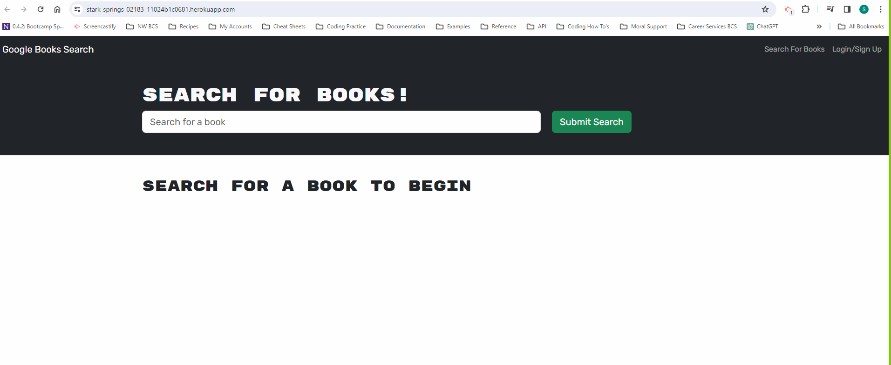

# MERN-Book-Search-Engine

## Screenshot

## Description

A dynamic book search engine built on the MERN (MongoDB, Express.js, React, Node.js) stack. This application empowers users to effortlessly search for books, save their favorite searches, and enjoy a personalized experience by creating an account with login capabilities. The seamless integration of MongoDB ensures robust data storage, while React provides an intuitive and responsive user interface. Dive into the world of literature with our MERN book search engine, combining modern technology with the joy of discovering and saving your favorite reads.

## Table of Contents

- [Technology](#technology)
- [Installation](#installation)
- [Links](#links)
- [License](#license)

## Technologies Used 

MongoDB - A NoSQL database system that is used to store, manage, and retrieve data in a flexible, schema-free format, particularly well-suited for applications with evolving and unpredictable data structures.
ExpressJS - A web application framework for Node.js that simplifies the process of building scalable and robust web applications by providing a set of features and tools for handling HTTP requests and responses.
ReactJS - Used to build elements of page including header, nav-bar, core content which changes based on user interaction, and footer.
NodeJS - A JavaScript runtime that allows developers to execute server-side code, enabling the development of scalable and efficient network applications.

## Installation 

To install the MERN Book Search Engine, git clone thie repository to your local computer. The user must also install Node.js in order to use this application.

## Links 

https://stark-springs-02183-11024b1c0681.herokuapp.com/

https://github.com/SherryK1103/MERN-Book-Search-Engine
